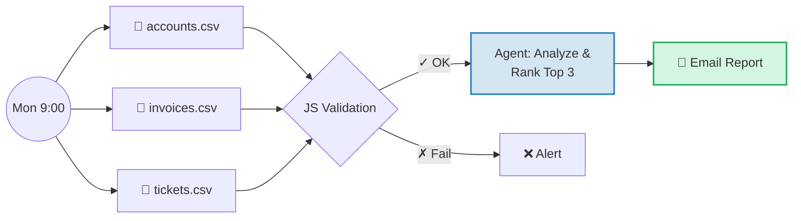

# B2B Sales Automation

> **Practice project.** I built this with Langdock in December 2025 as an exercise.
> I published it on 18-01-2026 as one commit. All accounts, invoices, and tickets are invented.
> Nothing here runs in production and no customer uses it.

## TL;DR

**Problem:** Sales reps spend a large part of their week on admin tasks instead of selling.
**Approach:** A deterministic workflow makes the weekly report. A chat assistant answers ad-hoc questions on the same data.
**What you see:** One Langdock workflow, one Langdock assistant, and the invented CSV data they read.

[Demo](#what-i-built) • [Development Story](./docs/JOURNEY.md) • [Tool Comparison](./docs/TOOL-COMPARISON.md)

---

## Assumption: What the Time Saving Could Be Worth

This is an estimate, not a measurement. Change the inputs and the result changes.

| Input | Value | Source |
|-------|-------|--------|
| Time saved per week | 2.5 h | My guess for one weekly report |
| Users | 1 | Only me, in a test workspace |
| Hourly rate | 25 € | Assumed |
| Weeks per year | 52 | |
| Build cost | 3.46 USD | Langdock usage during 35 test runs, see [JOURNEY.md](./docs/JOURNEY.md) |

Calculation: 2.5 h × 52 weeks × 25 € = 3,250 € per year for one user. Nobody measured this saving in real use.

---

## My Solution: Hybrid Architecture

| Use Case | Architecture | Why? |
|----------|--------------|------|
| Weekly Reports | **Deterministic** (Workflow) | Identical format, auditable, no hallucinations |
| Ad-hoc Analysis | **Probabilistic** (Assistant) | Flexible interpretation, context-dependent |

```
Accounts (WHO)   +   Invoices (HOW)   +   Tickets (HAPPY?)
                         ↓
            Priority Score: Top 3 accounts this week
```

---

## What I Built

### Workflow: Weekly Sales Report

Every Monday 9:00 AM. Identical output for identical data.



<details>
<summary><strong>Screenshot: Workflow Canvas</strong></summary>
<p align="center">
  
</p>
</details>

<details>
<summary><strong>Screenshot: Email Output</strong></summary>


</details>

### Assistant: Sales Research

User-initiated. Variable interpretation. Same data foundation.

**Example queries:**
- "Show me the top 3 accounts for this week"
- "Which customers have elevated churn risk?"
- "Create a pre-call briefing for TechFlow GmbH"

<details>
<summary><strong>Screenshot: Chat Response</strong></summary>
<p align="center">
  
</p>
</details>

---

## Key Technical Decisions

1. **Fail-Fast Validation:** JS validation runs *before* the LLM call → errors caught at $0 cost
2. **Simulated Data Layer:** Invented CSV files stand in for a CRM export. A real integration with Salesforce or HubSpot does not exist.

**Key Learning:** 80% of build costs occurred when the Agent executed with bad data. Validate first.

> Deep Dive: [Scoring Logic](./docs/SCORING.md) • [Full Journey](./docs/JOURNEY.md) • [Why LangDock?](./docs/TOOL-COMPARISON.md)

---

## Contact

**Yunus Ishaq**, Sales and AI Enthusiast

[](mailto:yunus@ishaq.de)
[](https://www.linkedin.com/in/yunusishaq/)

---

*December 2025*
